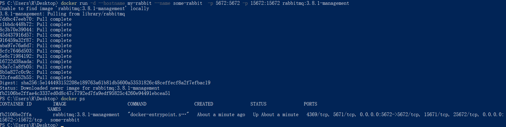
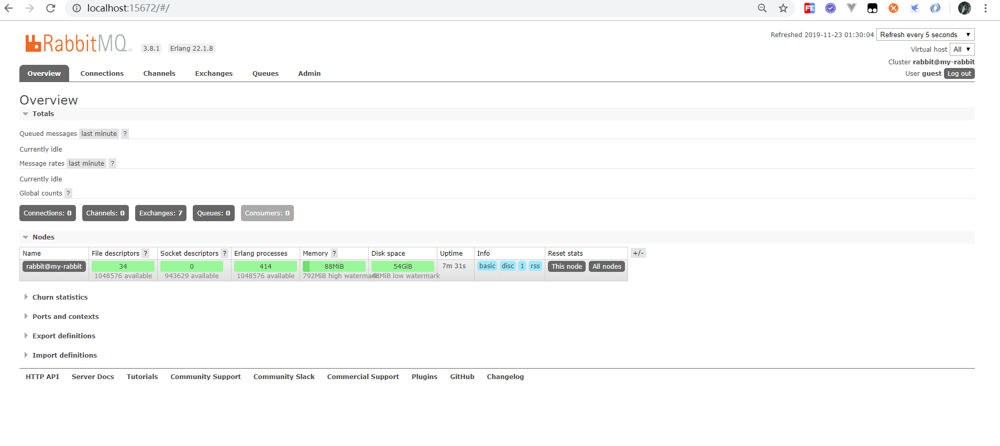

## [RebbitMQ 安装](https://www.rabbitmq.com/download.html)

### Linux

- [Ubuntu](https://www.rabbitmq.com/install-debian.html)

- [CentOS](https://www.rabbitmq.com/install-rpm.html)

### [Windows](https://www.rabbitmq.com/install-windows.html)

### [MacOS](https://www.rabbitmq.com/install-homebrew.html)

### [Docker](https://hub.docker.com/_/rabbitmq/)

```bash
docker run -d --hostname my-rabbit --name some-rabbit  -p 5672:5672 -p 15672:15672 rabbitmq:3.8.1-management
```




<http://localhost:15672/#/> 

账号密码: guest/guest




 
